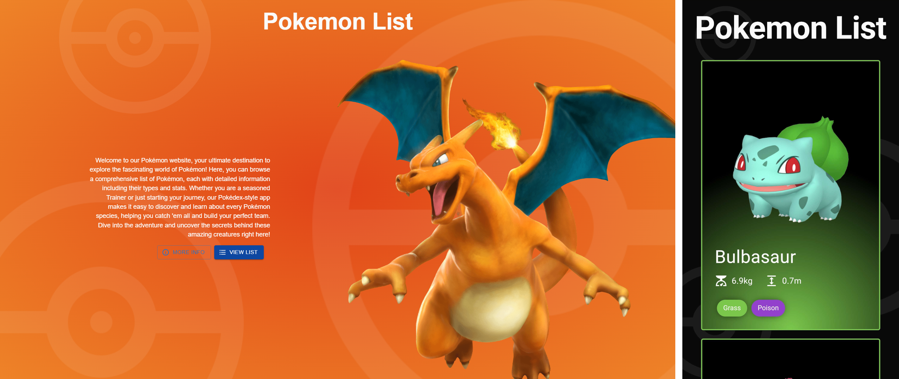

# ⚡ PokemonList


This is a modern and responsive landing page about Pokémon, made with React, TypeScript, and the MUI library. It has a clean and simple design that works well on different devices. The app has a main page and a subpage with a list of Pokémon. The Pokémon data is loaded from an external API and shown clearly. Thanks to pagination, users can see a few Pokémon at a time instead of the whole list. React Router allows smooth switching between pages without reloading, making the app easy and fast to use.



[**➥ Live**](https://oke225.github.io/PokemonList/)

## ⚙️ Technologies Used

- React
- TypeScript
- React Router
- MUI ( Material UI )
- API ( PokeAPI )
- Sass ( SCSS )
- JavaScript
- CSS
- HTML

## 💻 Features

- **API Data Fetching** - The app fetches Pokémon data from the PokeAPI, providing up-to-date and detailed information about each Pokémon.

- **Pagination** - Pagination uses a Material UI component to split the Pokémon list into smaller parts, showing only a limited number per page for better performance and usability.

- **React Router** - React Router enables smooth, fast navigation between pages without reloading the whole site.

- **Dialog Component** - Clicking a Pokémon card opens an MUI Dialog that displays more detailed information without leaving the current page.

- **Responsive design** - Achieved with Material-UI, the website automatically adjusts to different screen sizes, providing a comfortable browsing experience on both mobile and desktop devices.

- **Material UI (MUI) design** - The site uses Material UI for a clean, modern look with consistent styling and a responsive layout that works well on all devices, ensuring a polished and user-friendly interface.

## 📘 Local Setup

1. **Clone the Repository:**

   Open your terminal and clone the GitHub repository using:

   ```bash
   git clone https://github.com/OKE225/PokemonList.git
   ```

2. **Install Dependencies:**

   Navigate to the project directory:

   ```bash
   cd PokemonList
   ```

   Then install all dependencies using npm or yarn:

   ```bash
   npm install
   ```

   or

   ```bash
   yarn install
   ```

3. **Start the Application:**

   To run the application locally, use:

   ```bash
   npm start
   ```

   or

   ```bash
   yarn start
   ```

## 📄 License

The [MIT License](./LICENSE) (MIT). Please see License File for more information.

## 🔎 See Also

[GitHub profile](https://github.com/OKE225)
